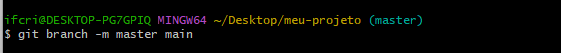
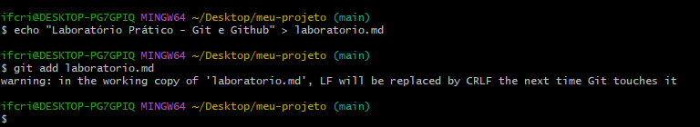

# Laboratório Prático - Git e Github

## 1. Configuração Inicial do Git
Antes de começar, configure seu nome e e-mail no Git:
```bash
git config --global user.name "Seu Nome"
git config --global user.email "seu.email@example.com"
```
### Exemplo:


## 2. Criar um Repositório Local
Crie uma pasta e entre nela:
```bash
mkdir meu-projeto
cd meu-projeto
```
Inicialize o repositório Git:
```bash
git init
```
### Exemplo:


## 3. Adicionar Arquivos e Fazer Commit
Crie o README.md:
```bash
echo "# Meu Projeto" > README.md
```
Verifique o status:
```bash
git status
```
Adicione o arquivo ao stage:
```bash
git commit -m "Primeiro commit: adiciona README.md"
```
### Exemplo:


## 4. Criar um Repositório no GitHub
### 4.1 Vá até github.com
### 4.2 Clique em "New repository"
### 4.3 Preencha os dados:
Nome: meu-projeto
Visibilidade: Público
Não selecione nenhuma opção adicional (README, .gitignore etc.)
Depois de criar, copie a URL gerada.
### Exemplo:


## 5. Conectar o Repositório Local ao GitHub

### 5.1 Criar Token no GitHub
Acesse as configurações do usuário no Github;
No menu da esquerda, escolha a opção “< > Developer Settings”;
Em “Personal access tokens”, selecione a opção “Fine-grained tokens”;
Clique no botão "Generate new token";
### Exemplo:

Preencha os dados do projeto, sendo que é importante manter o "Expiration" como "No expiration".
Além disso, em "Repository Access" marque a opção "Only select repositories" e selecione o repositório desejado, neste caso é o "meu-projeto".
### Exemplo:
  
  


Em “Permissions”, “Repository permissions”, selecione a opção “access: Read and Write” na opção “Contents”.


Por fim, clique em “Generate Token”.


### 5.2 Conctar Repositório
Caso a branch seja "master" renomeie para "main":
```bash
git branch -m master main
```
Adicione o remoto:
```bash
git remote add origin https://github.com/seu-usuario/meu-projeto.git
```
Atenção: o passo 5.1 é essencial para realizar a autenticação, pois é necessário o Token de acesso para realizar qualquer comunicação com o Repositório Remoto.
Envie para o GitHub:
```bash
git push -u origin main
```
Neste momento você será direcionado para fazer login. Selecione a opção "token" e cole o "token" gerado no passo 5.1.
### Exemplo:
  
  
  
  
  

## 6. Criar e Trabalhar em uma Nova Branch
Crie a nova branch:
```bash
git checkout -b feature/nova-funcionalidade
```
Crie o arquivo de funcionalidade:
```bash
echo "Nova funcionalidade em desenvolvimento" > nova-funcionalidade.txt
```
Adicione e comnit:
```bash
git add nova-funcionalidade.txt
git commit -m "Adiciona nova funcionalidade"
```
Envie a branch:
```bash
git push -u origin feature/nova-funcionalidade
```
### Exemplo:


## 7. Fazer Merge da Branch na Main
Volte para main:
```bash
git checkout main
```
Atualize a main:
```bash
git pull origin main
```
Mescle:
```bash
git merge feature/nova-funcionalidade
```
Envie:
```bash
git push origin main
```
### Exemplo:


## 8. Conteúdo extra: criação deste tutorial
Crie e adicione um texto qualquer ao arquivo do tutorial:
```bash
echo "Laboratorio Prático - Git e Github" > laboratorio.md
```
Utilizando o editor de texto que preferir, escreva o conteúdo do tutorial utilizando a linguagem Markdown.
Crie a pasta assets e adicione os prints capturados.
Adicione os arquivos ao stage:
```bash
git add assets
git add laboratorio.md
```
Faça o commit com uma mensagem descritiva:
```bash
git commit -m "Adiciona tutorial em Markdown com imagens do processo"
```
Envie para o repositório remoto:
```bash
git push origin main
```
### Exemplo:



